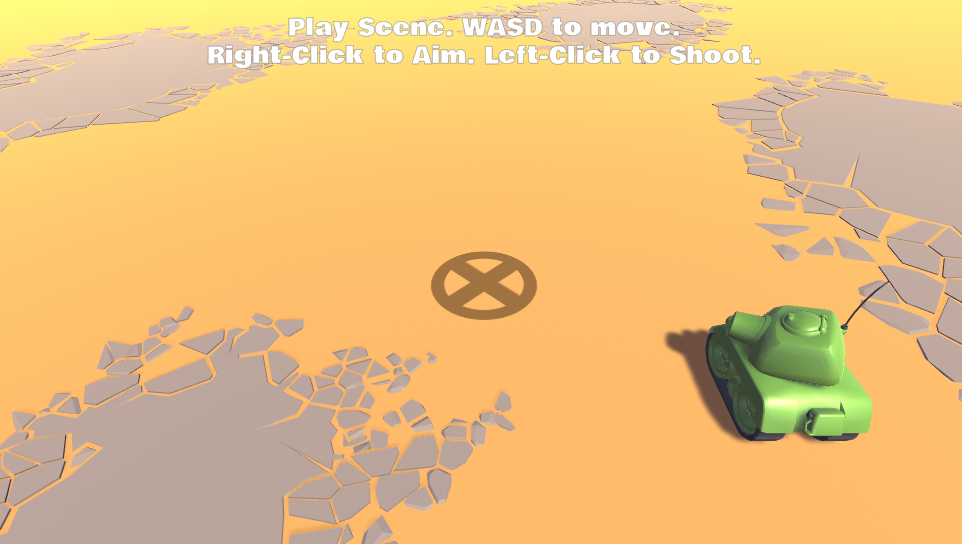

Tank Gun Trajectory Example
=============

Example of aiming and firing a tank gun with trajectory.

Instructions
=============

1. Open project
1. Open "Main" Scene
1. Play Scene
1. Follow onscreen instructions
1. The projectile "Bullet" will hit the "Target". Nice!

Note: The math in <a href="https://github.com/SamuelAsherRivello/tank-gun-trajectory-example/blob/master/Unity/Assets/Scripts/Runtime/RMC/TankGunTrajectory/View/Turret.cs">Turret.cs</a> DYNAMICALLY calculates the next turret elevation angle -- using the POSITION of the turret, the POSITION of the target, and a HARDCODED bullet speed.

Created By
=============

- Samuel Asher Rivello 
- Over 20 years XP with game development (2020)
- Over 8 years XP with Unity (2020)

Contact
=============

- Twitter - <a href="https://twitter.com/srivello/">@srivello</a>
- Resume & Portfolio - <a href="http://www.SamuelAsherRivello.com">SamuelAsherRivello.com</a>
- Git - <a href="https://github.com/SamuelAsherRivello/">Github.com/SamuelAsherRivello</a>
- LinkedIn - <a href="https://Linkedin.com/in/SamuelAsherRivello">Linkedin.com/in/SamuelAsherRivello</a> <--- Say Hello! :)

